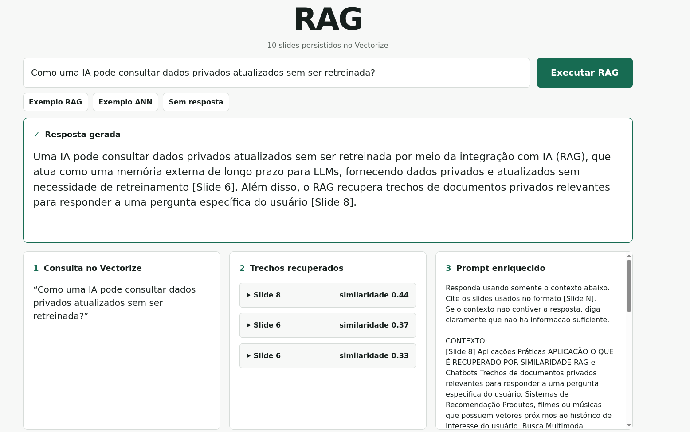

# RAG with a vector database

Running example for a **Vector Databases** presentation in the Database course of the Information Systems undergraduate program at UNESP.

Presentation: [`vector-databases-presentation.pptx`](public/vector-databases-presentation.pptx)

The project demonstrates this RAG workflow:

```text
First question
  → read PPTX and extract slide text
  → create slide embeddings with OpenRouter
  → store them in Cloudflare Vectorize

Every question
  → create a question embedding with OpenRouter
  → retrieve the three most similar slides from Vectorize
  → add those slides to the prompt
  → send the enriched prompt to the OpenRouter chat model
  → return the answer and sources
```

The PPTX is only re-embedded when the presentation or embedding model changes.

## Demo



## Run locally

1. Copy `.env.example` to `.env` and fill in the variables.
2. Run:

```bash
nix develop
npm install
npm run dev
```

## Deploy

```bash
npx wrangler login
npx wrangler vectorize create rag-slides-index --dimensions=1024 --metric=cosine
npx wrangler secret put OPENROUTER_API_KEY
npx wrangler secret put OPENROUTER_EMBEDDING_MODEL
npx wrangler secret put OPENROUTER_CHAT_MODEL
npx wrangler secret put APP_USERNAME
npx wrangler secret put APP_PASSWORD
npm run deploy
```

The embedding model must generate 1024-dimensional vectors.
